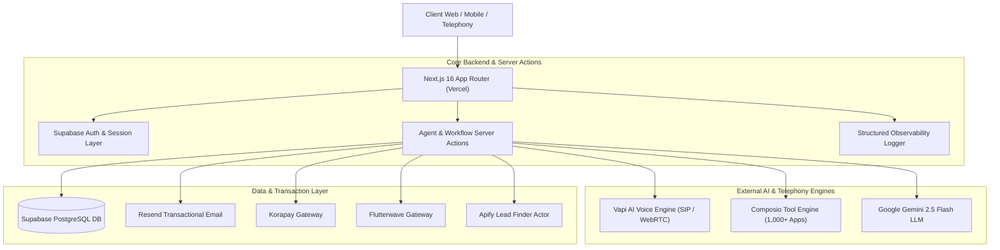

# Amira AI — Autonomous Voice Telephony & Work Operator Platform

<p align="center">
  <a href="https://heyamira.com">
    
  </a>
</p>

<p align="center">
  <strong>The 24/7 Autonomous AI Digital Employee Platform for Inbound/Outbound Telephony, Multi-Channel Workflows, and Tool Execution.</strong>
</p>

<p align="center">
  <a href="https://github.com/Richmondeke/tryamira/actions/workflows/ci.yml"></a>
  <a href="https://heyamira.com"></a>
  <a href="#"></a>
  <a href="#"></a>
  <a href="#"></a>
</p>

---

## 🌟 Overview

**Amira AI** is an enterprise-grade autonomous AI work operator platform. Unlike simple chat widgets, Amira acts as a real digital employee capable of:

- **Ultra-Low Latency Telephony**: Real-time inbound & outbound phone calls powered by Vapi, Deepgram Nova-2 transcription, and ElevenLabs / Cartesia / OpenAI voice engines.
- **Deep Integration Operator**: Native connectivity to 1,000+ workplace tools via Composio (Gmail, Google Calendar, Google Sheets, HubSpot, Slack, GitHub, Notion).
- **Proactive Semantic Intelligence**: Google Gemini 2.5 Flash semantic analysis for automatic meeting triage, inbox action item extraction, and scheduled autonomous workflow triggers.
- **Global & African Payment Infrastructure**: Turnkey billing with Korapay (NGN / Bank Transfer / Card) and Flutterwave (v4 direct charges).
- **B2B Cold Lead Sourcing Pipeline**: Integrated Apify Actor pipelines (`codecrafter~leads-finder`) targeting high call-volume sectors (HVAC, Plumbing, Medical Spas, Dispatchers, Real Estate).
- **Executive Daily Briefing Cron**: Automated daily multi-channel executive briefings and database keep-alive crons dispatched via Resend.

---

## 🏗️ System Architecture



---

## 🚀 Quick Start & Local Setup

### Prerequisites
- **Node.js**: `v20.x` or `v22.x`
- **npm**: `v10.x` or higher
- **Git**

### 1. Clone the Repository
```bash
git clone https://github.com/Richmondeke/tryamira.git
cd tryamira
```

### 2. Install Dependencies
```bash
npm install
```

### 3. Configure Environment Variables
Copy the template configuration file:
```bash
cp .env.example .env.local
```
Fill in the values in `.env.local` (see table below).

### 4. Run Development Server
```bash
npm run dev
```
Open [http://localhost:3000](http://localhost:3000) in your browser.

---

## 🧪 Testing & Code Quality

Amira enforces 100% runnable tests, static type safety, and linting on every commit and pull request via GitHub Actions CI (`.github/workflows/ci.yml`).

| Command | Description |
| :--- | :--- |
| `npm test` | Runs the full Vitest automated test suite |
| `npm run test:watch` | Runs Vitest in interactive watch mode |
| `npx tsc --noEmit` | Verifies TypeScript compiler strict typecheck |
| `npm run lint` | Runs Next.js ESLint quality checks |
| `npm run build` | Compiles production Next.js application build |

---

## 🔐 Environment Variables Reference

| Variable Name | Required | Description |
| :--- | :---: | :--- |
| `NEXT_PUBLIC_APP_URL` | Yes | Base URL of the deployment (e.g. `https://heyamira.com`) |
| `NEXT_PUBLIC_SUPABASE_URL` | Yes | Supabase PostgreSQL project instance URL |
| `NEXT_PUBLIC_SUPABASE_ANON_KEY` | Yes | Supabase public anonymous API key |
| `SUPABASE_SERVICE_ROLE_KEY` | Yes | Supabase privileged service role secret key |
| `NEXT_PUBLIC_VAPI_PUBLIC_KEY` | Yes | Vapi AI client-side WebRTC public token |
| `NEXT_PUBLIC_VAPI_ASSISTANT_ID` | Yes | Default Vapi AI Assistant ID |
| `VAPI_PRIVATE_API_KEY` | Yes | Vapi AI backend management private API key |
| `COMPOSIO_API_KEY` | Yes | Composio OAuth & Tool integration platform key |
| `GEMINI_API_KEY` | Yes | Google Gemini AI LLM API Key (Flash 2.5) |
| `RESEND_API_KEY` | Yes | Resend transactional email API key |
| `EMAIL_FROM` | No | Default email sender header (default: `Amira Intelligence <onboarding@resend.dev>`) |
| `APIFY_API_KEY` | Yes | Apify actor execution API key |
| `APIFY_ACTOR_ID` | Yes | Apify Leads Finder Actor ID (`IoSHqwTR9YGhzccez`) |
| `APIFY_ACTOR_NAME` | Yes | Apify Actor Name (`codecrafter~leads-finder`) |
| `KORAPAY_SECRET_KEY` | Yes | Korapay payment gateway secret key |
| `FLUTTERWAVE_SECRET_KEY` | Yes | Flutterwave API secret key |
| `FLUTTERWAVE_SECRET_HASH` | Yes | Flutterwave webhook HMAC signature hash |
| `CRON_SECRET` | Yes | Secret bearer token guarding cron routes (`/api/cron/*`) |
| `NEXT_PUBLIC_SENTRY_DSN` | No | Sentry error monitoring DSN |

---

## 📁 Repository Structure

```
tryamira/
├── .github/
│   └── workflows/
│       └── ci.yml                 # GitHub Actions CI (lint, typecheck, test, build)
├── public/                        # Static branding assets, icons, audio samples
├── scripts/                       # E2E test verification scripts
├── src/
│   ├── app/
│   │   ├── actions/               # Next.js Server Actions (agent, billing, integrations, vapi)
│   │   ├── api/                   # REST API routes (V1 assistants, webhooks, cron, leads)
│   │   ├── dashboard/             # Core SaaS dashboard pages (agents, calls, leads, billing)
│   │   ├── layout.tsx             # Root application layout & typography
│   │   └── page.tsx               # High-converting landing page
│   ├── components/                # Reusable UI component library (modals, tables, cards)
│   ├── contexts/                  # React Contexts (DemoMode, UserProfile)
│   ├── data/                      # Structured dataset definitions (agentTemplates.ts)
│   ├── hooks/                     # Custom React hooks (useLocalPricing, useDebounce)
│   ├── lib/                       # Utility libraries (logger.ts, voices.ts, email_reporter.ts)
│   └── utils/                     # Supabase clients & sanitization utilities
├── tests/                         # Automated unit & integration tests
├── .env.example                   # Complete configuration template
├── package.json                   # Project scripts and dependencies
├── tsconfig.json                  # Strict TypeScript configuration
└── vitest.config.ts               # Vitest test runner configuration
```

---

## 📄 License

Proprietary © Amira AI Inc. All rights reserved.
